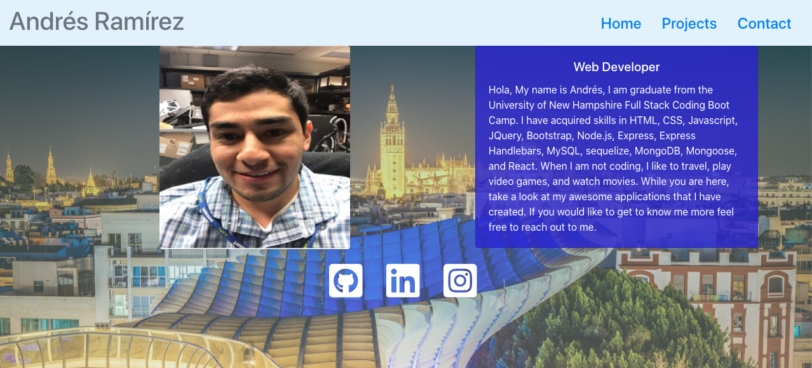

# React-Portfolio

# Background:

This is a new version of my portfolio. It now includes elements of React. Similar to my other versions of my portfolio, Everthing is almost the same with the exception of the background image and profile picture. I plan work on my portfolio a little bit more. Learning React has been quite tough but it is useful. Stay tuned.

# Technologies Used:
- Bootstrap
- CSS
- HTML
- Javascript
- React

# Screenshots

# License
This Repository is licensed under MIT

# Contact 
If you have any questions please feel free to reach me at:

- [Instagram](https://www.instagram.com/aramirez2142/)

- [Github](https://github.com/ARam2142)

- [LinkedIn](https://www.linkedin.com/in/andres-ramirez-8b07487b/)
# LiveLink
https://aram2142.github.io/React-Portfolio/

